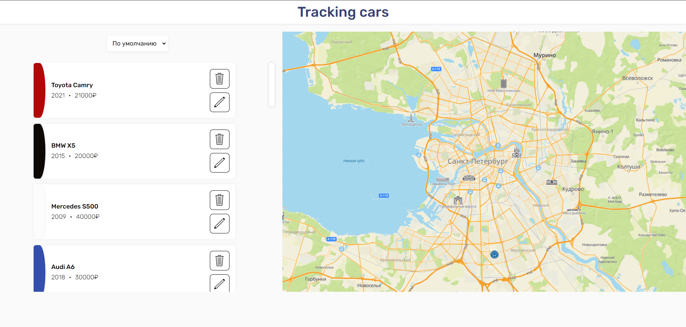
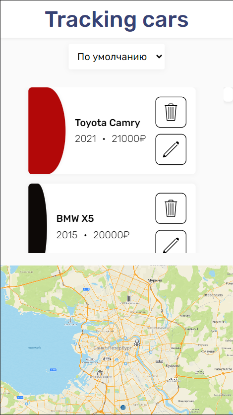

# Tracking car

Hi! I'm Eva. Thank you for deciding to familiarize yourself with my solution to the test task.

## Table of contents

- [Overview](#overview)
  - [Test task](#test-task)
  - [Screenshot](#screenshot)
- [My process](#my-process)
  - [Built with](#built-with)
- [Author](#author)

## Overview

### Test task

"Create a web page using the Vue or React framework.

- Get object data from the API by making a REST request. Using the data, draw the components of objects in the form of cards with fields;

- Implement sorting of objects by values (year of manufacture and cost);

- Add the ability to edit and delete cards on the frontend part (changing the brand name, model and cost);

**Additional task:**
To implement the display of objects on the map, using their coordinates. (You can use any API).

**The advantage will be the use of TypeScript**

P.S. The design of the UI is at your discretion".

### Screenshot

  
  
  
  
  
  
  

    
    
    
  

## My process

### Built with

- React
- TypeScript
- Feature-Sliced Design (FSD architecture)
- Redux Toolkit
- React Router
- SASS modules

## Author

- Frontend Mentor - [@GrigoryevaEva](https://www.frontendmentor.io/profile/GrigoryevaEva)
- GitHub - [@GrigoryevaEva](https://github.com/GrigoryevaEva)